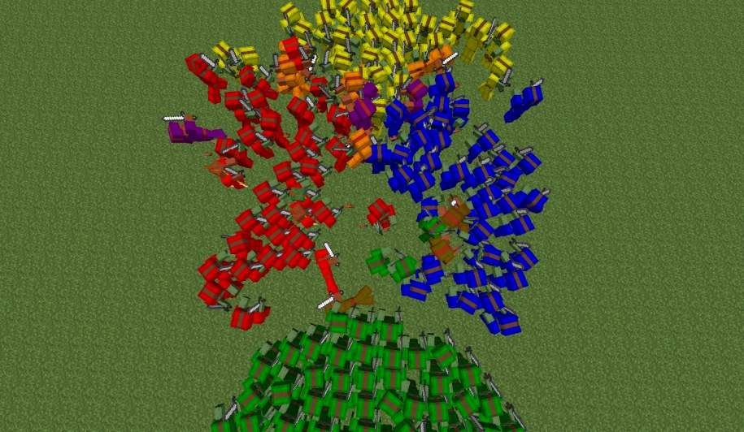
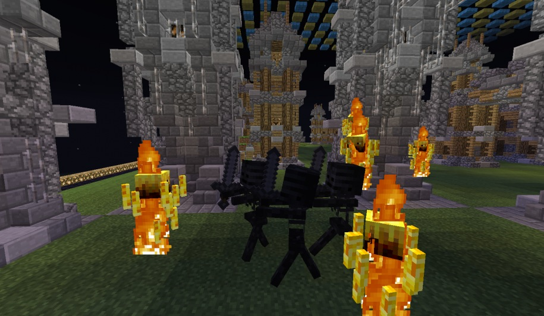
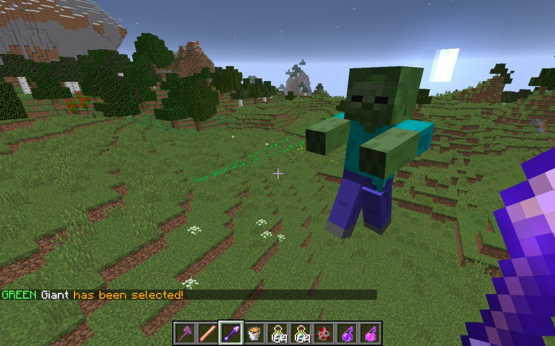
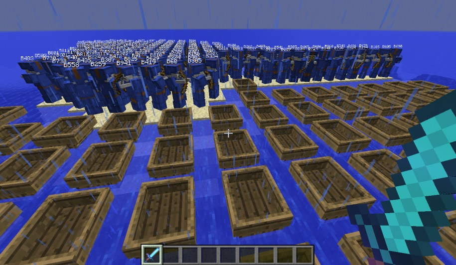
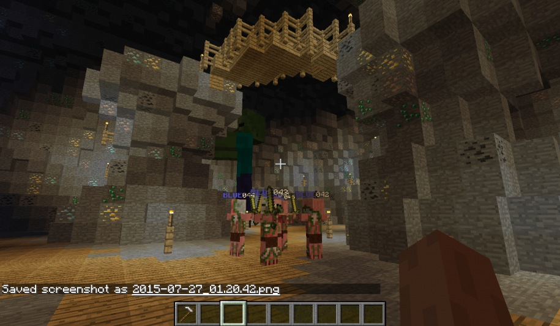
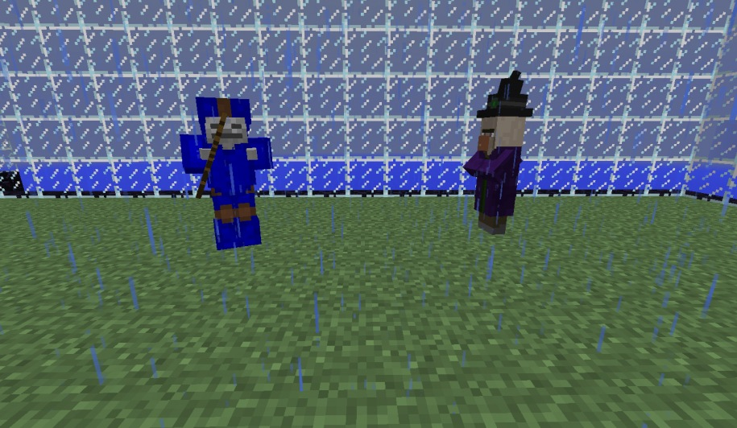
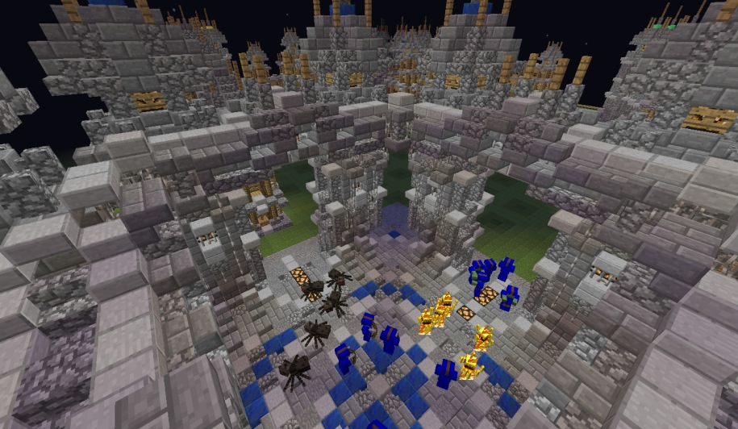

# Mob Wars
By R Lee (@AlphaRLee)

Mob Wars is Real Time Strategy (RTS) minigame implemented as a Minecraft plugin. Command armies of zombies, skeletons, blazes, giants, ~~cuccos~~ chickens and more while balancing your precious resources and taking down your enemy's armies.

## Update 2022-02-17
This project has been ported over from its 2016 origins.
At time of writing, this repo is only to document and publish the unfinished, non-working code.
The codebase relies on version-specific code from Minecraft 1.7.9 and needs a significant refactoring to be use-able.
Eventually this project will be updated to take advantage of the latest version of Minecraft, but there are no immediate plans to do so.

## Image Gallery
_Note: Many of these images were taken over development and do not reflect the latest product._

More images can be found [here](./docs/images). An unofficial (and no longer maintained) devlog can be found [here](https://www.enjin.com/profile/5713312/pics).